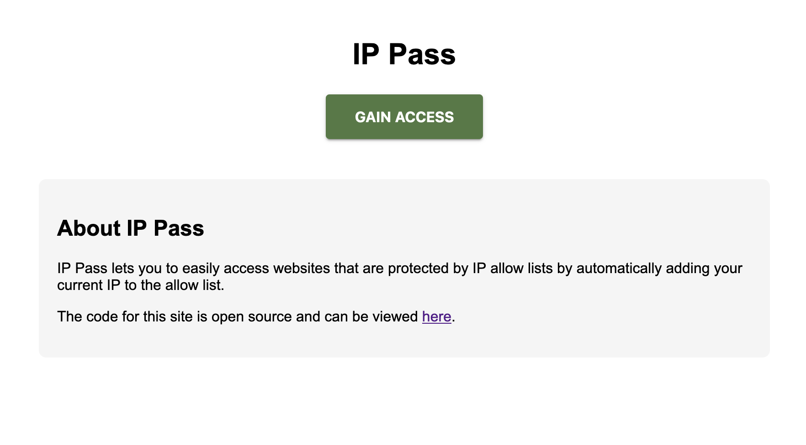

# ip-pass

Allow-list your IP by merely visiting a website. Ideal for side projects and home labs.

The main use-case is sharing self-hosted services with people (like distant friends and family) who can't install a VPN client or use a password manager. They can visit ip-pass, click a button, and gain access.

Currently only supports allow-listing via Traefik Middleware custom resources: <https://doc.traefik.io/traefik/middlewares/http/ipallowlist>

## Security

You should think of ip-pass as the equivalent of moving your SSH port to something other than 22: It will prevent automated scanners from hitting your server, but provides no protection against a malicious person. It's security by obscurity.

## Usage

Start the server, which will create a Middleware if one does not exist:
```
$ go run pkg/main.go -xff-depth=1
{"level":"info","ts":"2024-11-08T22:17:04-05:00","logger":"entrypoint","msg":"Created Middleware","name":"ip-pass-allowlist","namespace":"default"}
{"level":"info","ts":"2024-11-08T22:17:04-05:00","logger":"entrypoint","msg":"Starting server","addr":":8080"}
```
```
$ kubectl get middlewares.traefik.io -A
NAMESPACE   NAME                  AGE
default     ip-pass-allowlist     12s
```

Users can use the web interface to gain access, which can be configured to automatically redirect the user to a target site:



Or users can use the API:

```
$ curl -iX POST -H "X-Forwarded-For: 2001:0db8::123" localhost:8080/api/add-ip
HTTP/1.1 201 Created
Date: Sat, 09 Nov 2024 03:21:40 GMT
Content-Length: 0
```

Verify that the IP was allow-listed (we mask all IPs to the nearest /64 for IPv6 or /24 for IPv4):

```
$ kubectl get middlewares.traefik.io ip-pass-allowlist -o yaml
apiVersion: traefik.io/v1alpha1
kind: Middleware
metadata:
  creationTimestamp: "2024-11-09T03:17:04Z"
  generation: 2
  name: ip-pass-allowlist
  namespace: default
  resourceVersion: "12075625"
  uid: 012d7815-20e0-476e-a9a2-6f52c2dd16ce
spec:
  ipWhiteList:
    ipStrategy:
      depth: 1
    sourceRange:
    - 2001:db8::/64
```

## Configuration

```
-bind-addr string
  	Address to bind the HTTP server. (default ":8080")
-kubeconfig string
  	Paths to a kubeconfig. Only required if out-of-cluster.
-max-burst int
  	Maximum amount of bursting for kube-api requests (to prevent people from DoS'ing your cluster). (default 1)
-max-qps float
  	Maximum kube-api requests per second (to prevent people from DoS'ing your cluster). (default 1)
-middleware-name string
  	Name of the Middleware. (default "ip-pass-allowlist")
-middleware-namespace string
  	Namespace of the Middleware. (default "default")
-redirect-delay duration
  	How long to wait before redirecting (since allow-list updates may take time to propagate). (default 50ms)
-redirect-location string
  	Where to redirect the user after allow-listing them. (default "/success")
-timeout duration
  	Timeout duration for k8s API requests. (default 10s)
-xff-depth int
  	Number of elements from the end of the X-Forwarded-For header (starting with 1) to pull the real IP from. Defaults to zero which ignores XFF and just uses the observed client IP. The ipStrategy on the middleware will use 'max(xffDepth-1, 0)'.
```

### IP address detection

Typically, you will deploy ip-pass behind some kind of load balancer, which means ip-pass's default behavior of just adding the observed source IP to the allow list won't work for you (the load balancer's IP would end up in the allow list instead of the user's).

Instead, you should set `-xff-depth` to something other than zero to correctly parse the [`X-Forwarded-For`](https://developer.mozilla.org/en-US/docs/Web/HTTP/Headers/X-Forwarded-For) header. Since the header may contain multiple IPs (one per proxy that the request passed through), you need to set the `-xff-depth` carefully.

The depth refers to the number of elements from the end of the list (starting with 1) when determining which IP to use. It works just like [Traefik's depth parameter](https://doc.traefik.io/traefik/middlewares/http/ipallowlist/#ipstrategydepth). This strange method of counting is beneficial because you can use this rule of thumb: "The correct depth should equal the number of reverse proxies in front of ip-pass".

## Development

Must have Golang installed. Must install [goimports](https://pkg.go.dev/golang.org/x/tools/cmd/goimports).

Please set up a pre-commit hook by running this command:

```
cp ./pre-commit.sh .git/hooks/pre-commit
```

```
go run pkg/main.go -help
```

### Releasing

First, remember to update the tag in `k8s/app.yaml` and commit this before starting a release.

```
echo $GH_PAT | docker login ghcr.io -u mac-chaffee --password-stdin
export TAG=vX.Y.X
./release.sh
```

## Installation - Kubernetes

This project uses [Kustomize](https://kubectl.docs.kubernetes.io/references/kustomize/kustomization/). In your own repo, you can create your own `kustomization.yaml` file overlay like this:

```yaml
apiVersion: kustomize.config.k8s.io/v1beta1
kind: Kustomization
resources:
# Set the ref to the latest available tag
- https://github.com/mac-chaffee/ip-pass//k8s?ref=vX.Y.Z
# You may want to deploy other supporting resources such as a namespace
- your-other-resources.yaml
patches:
# Example of setting custom CLI args
- patch: |-
    - op: replace
      path: /spec/template/spec/containers/0/args
      value:
        - -middleware-name=custom-name
        - -middleware-namespace=custom-namespace
  target:
    kind: Deployment
    name: ip-pass
```

Then install it with `kubectl apply -k <path>`

```
$ kubectl apply -k ./k8s/
serviceaccount/ip-pass created
clusterrole.rbac.authorization.k8s.io/traefik-middleware-editor created
clusterrolebinding.rbac.authorization.k8s.io/traefik-middleware-editor-binding created
service/ip-pass created
deployment.apps/ip-pass created
ingress.networking.k8s.io/ip-pass created
```

## Production-readiness

Do not use this in production. Expect bug reports, feature requests, and PRs to be neglected.
